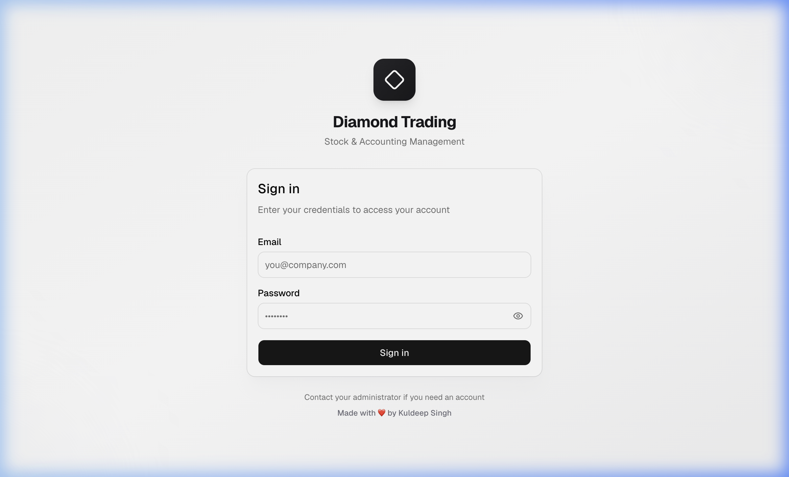

# 💎 Inventory Management System for Diamond Company

> **This entire project was built and deployed using [Antigravity IDE](https://antigravity.dev) and its AI Agent — from code generation, bug fixing, database schema design, to production deployment on Vercel.**

🔗 **Live Demo**: [https://inventory-management-system-for-dia.vercel.app](https://inventory-management-system-for-dia.vercel.app)

## Screenshots

### Login Page


## ✨ Features

- **📦 Stock Management** — Add, upload (Excel/CSV bulk import), search, filter by category, and adjust diamond inventory
- **🛒 Purchase Orders** — Create purchase memos, convert to bills, process returns with debit notes
- **💰 Sales Orders** — Create sales memos, convert to invoices, track returns with credit notes
- **🧾 Invoicing & Payments** — Generate invoices from sales, record payments (cash, bank, Zelle), auto-balance tracking
- **👥 Contact Management** — Manage vendors, customers, and dual-type contacts with full transaction history
- **🔐 Role-Based Access Control** — Admin and user roles with granular module-level permissions (CRUD per module)
- **📊 Dashboard** — Monthly sales overview, receivables, payables, and recent transaction feed
- **📤 Export** — Export any data table to Excel with one click
- **🔒 Security** — Supabase Row Level Security (RLS) on every table, admin-only delete operations

## 🛠️ Tech Stack

| Layer | Technology |
|---|---|
| **Frontend** | Next.js 16, React 19, TypeScript |
| **Styling** | Tailwind CSS 4, Base UI (shadcn components) |
| **Backend** | Supabase (PostgreSQL + Auth + RLS) |
| **Deployment** | Vercel |
| **IDE** | Antigravity IDE with AI Agent |

## 🚀 Getting Started

### Prerequisites
- Node.js 20+
- A Supabase project ([supabase.com](https://supabase.com))

### 1. Clone the repository
```bash
git clone https://github.com/kuldeepsingh343/Inventory-Management-System-for-Diamond-Company.git
cd Inventory-Management-System-for-Diamond-Company
npm install
```

### 2. Set up Supabase
1. Create a new project at [supabase.com](https://supabase.com)
2. Go to **SQL Editor** and run the contents of `supabase/schema.sql`
3. Go to **Authentication → Users** and create your first admin user

### 3. Configure environment
Create a `.env.local` file:
```env
NEXT_PUBLIC_SUPABASE_URL=https://your-project-id.supabase.co
NEXT_PUBLIC_SUPABASE_ANON_KEY=your-anon-key
```

### 4. Run locally
```bash
npm run dev
```
Open [http://localhost:3000](http://localhost:3000) in your browser.

## 📁 Project Structure

```
src/
├── app/
│   ├── (dashboard)/          # Protected dashboard pages
│   │   ├── stock/            # Stock management, upload, adjust
│   │   ├── purchases/        # Purchase orders, returns
│   │   ├── sales/            # Sales orders
│   │   ├── invoices/         # Invoicing & payments
│   │   ├── contacts/         # Contact management
│   │   └── settings/         # Admin user/permissions management
│   └── login/                # Authentication page
├── components/               # Reusable UI components
├── lib/
│   ├── actions/              # Server actions (CRUD operations)
│   ├── supabase/             # Supabase client/server/middleware
│   ├── hooks/                # Custom React hooks
│   └── types/                # TypeScript type definitions
└── proxy.ts                  # Next.js 16 proxy (auth middleware)
```

## 👨‍💻 Author

**Made with ❤️ by Kuldeep Singh**

Built entirely using **Antigravity IDE** and its AI-powered coding agent.
